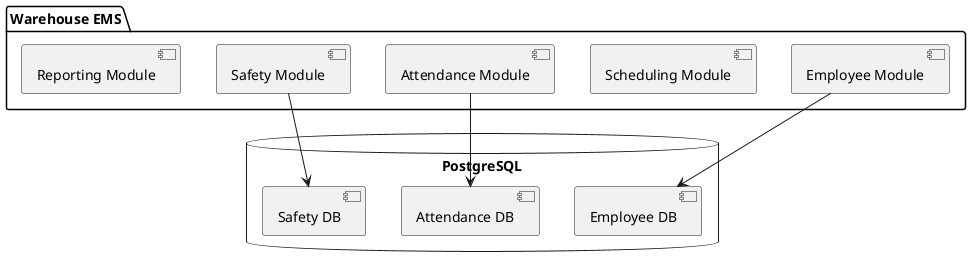

# Warehouse Employee Management System (EMS) - Low-Level Technical Design Document

## Overview
This document provides comprehensive low-level technical design for all 77 user stories of the Warehouse Employee Management System, following Spring Boot best practices and industry standards.

---

## Section: Initialize Spring Boot Project

**Description:** Establishes the foundational Spring Boot project using Maven, setting up the baseline for all EMS modules and ensuring a standardized, maintainable structure.

**Design Specification:**
- Use Spring Initializr or Maven archetype to bootstrap the project
- GroupId: com.warehouse.ems, ArtifactId: warehouse-ems, Packaging: jar, Java 17+
- Add dependencies: spring-boot-starter-web, spring-boot-starter-data-jpa, spring-boot-starter-security, spring-boot-starter-actuator, flyway-core or liquibase-core, spring-boot-starter-validation, spring-boot-starter-mail
- Set up main application class in com.warehouse.ems
- Enable Actuator endpoints for health checks

**Sample Implementation:**
```java
@SpringBootApplication
public class WarehouseEmsApplication {
    public static void main(String[] args) {
        SpringApplication.run(WarehouseEmsApplication.class, args);
    }
}
```

application.properties:
```properties
server.port=8080
spring.application.name=warehouse-ems
management.endpoints.web.exposure.include=health,info
```

---

## Section: Set Up Base Package Structure and Core Modules

**Description:** Organizes the codebase into logical modules for scalability and maintainability, separating concerns for employee, scheduling, attendance, and safety.

**Design Specification:**
- Package structure:
  - com.warehouse.ems.employee
  - com.warehouse.ems.scheduling
  - com.warehouse.ems.attendance
  - com.warehouse.ems.safety
  - com.warehouse.ems.common
  - com.warehouse.ems.config
  - com.warehouse.ems.security
- Each module contains: domain (entities), repository, service, controller, dto, mapper

**Sample Implementation:**
```
src/main/java/com/warehouse/ems/employee/Employee.java
src/main/java/com/warehouse/ems/employee/EmployeeRepository.java
src/main/java/com/warehouse/ems/employee/EmployeeService.java
src/main/java/com/warehouse/ems/employee/EmployeeController.java
```

---

## Section: Enable Database Migration Management

**Description:** Ensures all schema changes are versioned and applied consistently using Flyway or Liquibase.

**Design Specification:**
- Add Flyway or Liquibase dependency
- Place migration scripts in src/main/resources/db/migration (Flyway) or db/changelog (Liquibase)
- Configure migration tool in application.properties

**Sample Implementation:**

application.properties:
```properties
spring.flyway.enabled=true
spring.flyway.locations=classpath:db/migration
```

Sample migration (V1__init.sql):
```sql
CREATE TABLE employee (
    id BIGINT PRIMARY KEY AUTO_INCREMENT,
    badge_id VARCHAR(50) UNIQUE NOT NULL,
    name VARCHAR(100) NOT NULL,
    role VARCHAR(50) NOT NULL,
    department VARCHAR(50),
    shift_group VARCHAR(50),
    hire_date DATE,
    status VARCHAR(20) NOT NULL
);
```

---

## Section: Create Employee Record via API

**Description:** Implements secure REST API for creating employee records, enforcing unique badgeId and required fields.

**Design Specification:**
- Entity: Employee (id, badgeId, name, role, department, shiftGroup, hireDate, status)
- Repository: EmployeeRepository extends JpaRepository<Employee, Long>
- Service: EmployeeService with createEmployee(EmployeeDto)
- Controller: POST /api/employees
- DTO: EmployeeDto for request/response
- Validation: @NotNull, @Size, @Pattern as needed

**Sample Implementation:**

Employee.java:
```java
@Entity
@Table(name = "employee")
public class Employee {
    @Id 
    @GeneratedValue(strategy = GenerationType.IDENTITY)
    private Long id;
    
    @Column(unique = true, nullable = false)
    private String badgeId;
    
    @Column(nullable = false)
    private String name;
    
    private String role;
    private String department;
    private String shiftGroup;
    private LocalDate hireDate;
    
    @Column(nullable = false)
    private String status;
    
    // getters/setters
}
```

EmployeeRepository.java:
```java
public interface EmployeeRepository extends JpaRepository<Employee, Long> {
    Optional<Employee> findByBadgeId(String badgeId);
}
```

EmployeeService.java:
```java
@Service
public class EmployeeService {
    @Autowired
    private EmployeeRepository repository;
    
    @Autowired
    private EmployeeMapper mapper;
    
    public EmployeeDto createEmployee(EmployeeDto dto) {
        if (repository.findByBadgeId(dto.getBadgeId()).isPresent()) {
            throw new DuplicateBadgeIdException();
        }
        Employee emp = mapper.toEntity(dto);
        emp.setStatus("ACTIVE");
        return mapper.toDto(repository.save(emp));
    }
}
```

EmployeeController.java:
```java
@RestController
@RequestMapping("/api/employees")
public class EmployeeController {
    @Autowired
    private EmployeeService service;
    
    @PostMapping
    @PreAuthorize("hasRole('HR') or hasRole('ADMIN')")
    public ResponseEntity<EmployeeDto> create(@Valid @RequestBody EmployeeDto dto) {
        return ResponseEntity.status(HttpStatus.CREATED).body(service.createEmployee(dto));
    }
}
```

---

## Section: Update Employee Record via API

**Description:** Allows secure updates to employee records, ensuring only authorized roles can modify data.

**Design Specification:**
- PUT/PATCH /api/employees/{id}
- DTO validation
- Service: updateEmployee(Long id, EmployeeDto dto)
- Soft validation for badgeId uniqueness

**Sample Implementation:**
```java
@PutMapping("/{id}")
@PreAuthorize("hasRole('HR') or hasRole('ADMIN')")
public ResponseEntity<EmployeeDto> update(@PathVariable Long id, @Valid @RequestBody EmployeeDto dto) {
    return ResponseEntity.ok(service.updateEmployee(id, dto));
}
```

EmployeeService.java:
```java
public EmployeeDto updateEmployee(Long id, EmployeeDto dto) {
    Employee emp = repository.findById(id).orElseThrow(NotFoundException::new);
    mapper.updateEntity(dto, emp);
    return mapper.toDto(repository.save(emp));
}
```

---

## Section: Delete Employee Record via API

**Description:** Implements soft-delete for employee records, archiving rather than removing data.

**Design Specification:**
- DELETE /api/employees/{id}
- Entity: add boolean field 'deleted' or status 'ARCHIVED'
- Service: mark employee as deleted/status=ARCHIVED

**Sample Implementation:**
```java
@DeleteMapping("/{id}")
@PreAuthorize("hasRole('HR') or hasRole('ADMIN')")
public ResponseEntity<Void> delete(@PathVariable Long id) {
    service.softDeleteEmployee(id);
    return ResponseEntity.noContent().build();
}
```

EmployeeService.java:
```java
public void softDeleteEmployee(Long id) {
    Employee emp = repository.findById(id).orElseThrow(NotFoundException::new);
    emp.setStatus("ARCHIVED");
    repository.save(emp);
}
```

---

## Section: Retrieve Employee Records with Pagination and Filtering

**Description:** Enables efficient retrieval of employee data with support for pagination and filtering.

**Design Specification:**
- GET /api/employees?page=0&size=20&status=ACTIVE&department=Shipping
- Repository: use JpaSpecificationExecutor for dynamic queries
- Service: findEmployees(Pageable pageable, EmployeeFilter filter)

**Sample Implementation:**
```java
@GetMapping
@PreAuthorize("hasRole('HR') or hasRole('ADMIN') or hasRole('SUPERVISOR')")
public Page<EmployeeDto> list(@RequestParam Map<String, String> params, Pageable pageable) {
    return service.findEmployees(pageable, params);
}
```

EmployeeRepository.java:
```java
public interface EmployeeRepository extends JpaRepository<Employee, Long>, JpaSpecificationExecutor<Employee> {
}
```

EmployeeService.java:
```java
public Page<EmployeeDto> findEmployees(Pageable pageable, Map<String, String> filters) {
    Specification<Employee> spec = EmployeeSpecification.buildSpec(filters);
    return repository.findAll(spec, pageable).map(mapper::toDto);
}
```

---

## Section: Configure Role-Based Access Control

**Description:** Secures the application using Spring Security with roles ADMIN, HR, SUPERVISOR, WORKER.

**Design Specification:**
- Define roles in database or as enums
- Configure method and endpoint security
- Use @PreAuthorize, @Secured annotations
- SecurityConfig.java: configure HttpSecurity, password encoding, userDetailsService

**Sample Implementation:**

SecurityConfig.java:
```java
@Configuration
@EnableWebSecurity
@EnableGlobalMethodSecurity(prePostEnabled = true)
public class SecurityConfig extends WebSecurityConfigurerAdapter {
    
    @Override
    protected void configure(HttpSecurity http) throws Exception {
        http
            .csrf().disable()
            .authorizeRequests()
                .antMatchers("/api/employees/**").hasAnyRole("HR", "ADMIN")
                .antMatchers("/api/attendance/**").hasAnyRole("WORKER", "SUPERVISOR", "HR", "ADMIN")
                .anyRequest().authenticated()
            .and()
            .httpBasic();
    }
    
    @Bean
    public PasswordEncoder passwordEncoder() {
        return new BCryptPasswordEncoder();
    }
}
```

---

## Section: Enforce Endpoint-Level Security

**Description:** Restricts API endpoints to authorized roles using Spring Security.

**Design Specification:**
- Use @PreAuthorize on controller methods
- Configure antMatchers in SecurityConfig

**Sample Implementation:**
```java
@PreAuthorize("hasRole('HR') or hasRole('ADMIN')")
@PostMapping("/api/employees")
public ResponseEntity<EmployeeDto> create(@Valid @RequestBody EmployeeDto dto) { 
    return ResponseEntity.status(HttpStatus.CREATED).body(service.createEmployee(dto));
}
```

---

## Section: Implement Row-Level Security

**Description:** Ensures users can only access data within their scope (e.g., SUPERVISOR sees only their team).

**Design Specification:**
- Add supervisorId/teamId to Employee entity
- Filter queries by current user's scope
- Use Spring Security's Authentication object to get user details

**Sample Implementation:**

Employee.java:
```java
@ManyToOne
@JoinColumn(name = "supervisor_id")
private Employee supervisor;
```

EmployeeRepository.java:
```java
@Query("SELECT e FROM Employee e WHERE e.supervisor.id = :supervisorId")
List<Employee> findBySupervisorId(Long supervisorId);
```

EmployeeService.java:
```java
public List<EmployeeDto> getTeamEmployees(Authentication auth) {
    UserDetails user = (UserDetails) auth.getPrincipal();
    Long supervisorId = getUserIdFromAuth(user);
    return mapper.toDto(repository.findBySupervisorId(supervisorId));
}
```

---

## Section: Clock In via API

**Description:** Allows workers to clock in, capturing time, location, and device info.

**Design Specification:**
- Entity: Attendance (id, employeeId, clockInTime, clockInLocation, deviceId, status)
- POST /api/attendance/clock-in
- Validate employee status, geofence (if enabled)

**Sample Implementation:**

Attendance.java:
```java
@Entity
@Table(name = "attendance")
public class Attendance {
    @Id 
    @GeneratedValue(strategy = GenerationType.IDENTITY)
    private Long id;
    
    @ManyToOne
    @JoinColumn(name = "employee_id")
    private Employee employee;
    
    private LocalDateTime clockInTime;
    private String clockInLocation;
    private String deviceId;
    private String status; // CLOCKED_IN, CLOCKED_OUT
    
    // getters/setters
}
```

AttendanceController.java:
```java
@RestController
@RequestMapping("/api/attendance")
public class AttendanceController {
    @Autowired
    private AttendanceService service;
    
    @PostMapping("/clock-in")
    @PreAuthorize("hasRole('WORKER')")
    public ResponseEntity<AttendanceDto> clockIn(@RequestBody ClockInRequest req) {
        return ResponseEntity.ok(service.clockIn(req));
    }
}
```

AttendanceService.java:
```java
@Service
public class AttendanceService {
    @Autowired
    private AttendanceRepository repository;
    
    public AttendanceDto clockIn(ClockInRequest req) {
        Attendance att = new Attendance();
        att.setEmployee(employeeRepository.findById(req.getEmployeeId()).orElseThrow());
        att.setClockInTime(LocalDateTime.now());
        att.setClockInLocation(req.getLocation());
        att.setDeviceId(req.getDeviceId());
        att.setStatus("CLOCKED_IN");
        return mapper.toDto(repository.save(att));
    }
}
```

---

## Section: Clock Out via API

**Description:** Allows workers to clock out, calculating hours worked.

**Design Specification:**
- PATCH /api/attendance/clock-out
- Update Attendance record with clockOutTime, calculate duration

**Sample Implementation:**

Attendance.java:
```java
private LocalDateTime clockOutTime;
private Long shiftDurationMinutes;
```

AttendanceService.java:
```java
public AttendanceDto clockOut(Long attendanceId, ClockOutRequest req) {
    Attendance att = repository.findById(attendanceId).orElseThrow();
    att.setClockOutTime(LocalDateTime.now());
    long minutes = Duration.between(att.getClockInTime(), att.getClockOutTime()).toMinutes();
    att.setShiftDurationMinutes(minutes);
    att.setStatus("CLOCKED_OUT");
    return mapper.toDto(repository.save(att));
}
```

AttendanceController.java:
```java
@PatchMapping("/clock-out/{id}")
@PreAuthorize("hasRole('WORKER')")
public ResponseEntity<AttendanceDto> clockOut(@PathVariable Long id, @RequestBody ClockOutRequest req) {
    return ResponseEntity.ok(service.clockOut(id, req));
}
```

---

## Section: Handle Missed Punches and Corrections

**Description:** Supports workflow for missed punches and corrections, requiring supervisor approval.

**Design Specification:**
- Entity: AttendanceCorrection (id, attendanceId, requestedBy, reason, status)
- POST /api/attendance/corrections
- Supervisor approval endpoint

**Sample Implementation:**

AttendanceCorrection.java:
```java
@Entity
public class AttendanceCorrection {
    @Id 
    @GeneratedValue
    private Long id;
    
    @ManyToOne
    private Attendance attendance;
    
    private String reason;
    private String status; // PENDING, APPROVED, REJECTED
    private Long requestedBy;
    private LocalDateTime requestedAt;
    
    // getters/setters
}
```

AttendanceCorrectionController.java:
```java
@PostMapping("/corrections")
@PreAuthorize("hasRole('WORKER')")
public ResponseEntity<AttendanceCorrectionDto> requestCorrection(@RequestBody CorrectionRequest req) {
    return ResponseEntity.ok(service.requestCorrection(req));
}

@PatchMapping("/corrections/{id}/approve")
@PreAuthorize("hasRole('SUPERVISOR')")
public ResponseEntity<Void> approve(@PathVariable Long id) {
    service.approveCorrection(id);
    return ResponseEntity.ok().build();
}
```

---

## Section: Export Attendance Reports

**Description:** Enables export of attendance data in CSV format for analysis and payroll.

**Design Specification:**
- GET /api/attendance/export?format=csv
- Service: generate CSV from attendance records

**Sample Implementation:**

AttendanceController.java:
```java
@GetMapping("/export")
@PreAuthorize("hasRole('HR') or hasRole('ADMIN')")
public void exportAttendance(HttpServletResponse response) throws IOException {
    response.setContentType("text/csv");
    response.setHeader("Content-Disposition", "attachment; filename=attendance.csv");
    service.exportAttendanceCsv(response.getOutputStream());
}
```

AttendanceService.java:
```java
public void exportAttendanceCsv(OutputStream out) throws IOException {
    List<Attendance> records = repository.findAll();
    CSVWriter writer = new CSVWriter(new OutputStreamWriter(out));
    writer.writeNext(new String[]{"Employee", "Clock In", "Clock Out", "Duration"});
    for (Attendance att : records) {
        writer.writeNext(new String[]{
            att.getEmployee().getName(),
            att.getClockInTime().toString(),
            att.getClockOutTime() != null ? att.getClockOutTime().toString() : "",
            att.getShiftDurationMinutes() != null ? att.getShiftDurationMinutes().toString() : ""
        });
    }
    writer.close();
}
```

---

## Section: Create Shift Templates

**Description:** Allows creation of recurring shift templates for standardized scheduling.

**Design Specification:**
- Entity: ShiftTemplate (id, name, startTime, endTime, recurrencePattern)
- POST /api/shifts/templates

**Sample Implementation:**

ShiftTemplate.java:
```java
@Entity
public class ShiftTemplate {
    @Id 
    @GeneratedValue
    private Long id;
    private String name;
    private LocalTime startTime;
    private LocalTime endTime;
    private String recurrencePattern; // DAILY, WEEKLY, CUSTOM
    
    // getters/setters
}
```

ShiftTemplateController.java:
```java
@PostMapping("/api/shifts/templates")
@PreAuthorize("hasRole('SUPERVISOR') or hasRole('ADMIN')")
public ResponseEntity<ShiftTemplateDto> create(@Valid @RequestBody ShiftTemplateDto dto) {
    return ResponseEntity.status(HttpStatus.CREATED).body(service.createTemplate(dto));
}
```

---

## Section: Assign Shifts to Employees

**Description:** Enables supervisors to assign shifts to employees with conflict detection.

**Design Specification:**
- Entity: ShiftAssignment (id, employeeId, shiftTemplateId, date)
- POST /api/shifts/assignments
- Conflict detection logic

**Sample Implementation:**

ShiftAssignment.java:
```java
@Entity
public class ShiftAssignment {
    @Id 
    @GeneratedValue
    private Long id;
    
    @ManyToOne
    private Employee employee;
    
    @ManyToOne
    private ShiftTemplate shiftTemplate;
    
    private LocalDate date;
    
    // getters/setters
}
```

ShiftAssignmentService.java:
```java
public ShiftAssignmentDto assignShift(ShiftAssignmentDto dto) {
    if (hasConflict(dto.getEmployeeId(), dto.getDate())) {
        throw new ShiftConflictException();
    }
    ShiftAssignment assignment = mapper.toEntity(dto);
    return mapper.toDto(repository.save(assignment));
}

private boolean hasConflict(Long employeeId, LocalDate date) {
    return repository.existsByEmployeeIdAndDate(employeeId, date);
}
```

---

## Section: View Personal Schedule

**Description:** Allows workers to view their upcoming shifts.

**Design Specification:**
- GET /api/shifts/my-schedule
- Filter by current user

**Sample Implementation:**
```java
@GetMapping("/api/shifts/my-schedule")
@PreAuthorize("hasRole('WORKER')")
public List<ShiftAssignmentDto> getMySchedule(Authentication auth) {
    Long employeeId = getUserIdFromAuth(auth);
    return service.getScheduleForEmployee(employeeId);
}
```

---

## Section: Manage Blackout Dates and Operation Calendars

**Description:** Manages warehouse closures and holidays to prevent scheduling conflicts.

**Design Specification:**
- Entity: BlackoutDate (id, date, reason)
- POST /api/calendar/blackout-dates

**Sample Implementation:**

BlackoutDate.java:
```java
@Entity
public class BlackoutDate {
    @Id 
    @GeneratedValue
    private Long id;
    private LocalDate date;
    private String reason;
    
    // getters/setters
}
```

---

## Section: Request Leave via API

**Description:** Allows workers to request time off with balance validation.

**Design Specification:**
- Entity: LeaveRequest (id, employeeId, leaveType, startDate, endDate, status)
- POST /api/leave/requests

**Sample Implementation:**

LeaveRequest.java:
```java
@Entity
public class LeaveRequest {
    @Id 
    @GeneratedValue
    private Long id;
    
    @ManyToOne
    private Employee employee;
    
    private String leaveType; // PTO, SICK, UNPAID
    private LocalDate startDate;
    private LocalDate endDate;
    private String status; // PENDING, APPROVED, DENIED
    
    // getters/setters
}
```

LeaveRequestController.java:
```java
@PostMapping("/api/leave/requests")
@PreAuthorize("hasRole('WORKER')")
public ResponseEntity<LeaveRequestDto> requestLeave(@RequestBody LeaveRequestDto dto) {
    return ResponseEntity.ok(service.requestLeave(dto));
}
```

---

## Section: Approve or Deny Leave Requests

**Description:** Enables supervisors to approve or deny leave requests.

**Design Specification:**
- PATCH /api/leave/requests/{id}/approve
- PATCH /api/leave/requests/{id}/deny

**Sample Implementation:**
```java
@PatchMapping("/api/leave/requests/{id}/approve")
@PreAuthorize("hasRole('SUPERVISOR')")
public ResponseEntity<Void> approve(@PathVariable Long id) {
    service.approveLeave(id);
    return ResponseEntity.ok().build();
}

@PatchMapping("/api/leave/requests/{id}/deny")
@PreAuthorize("hasRole('SUPERVISOR')")
public ResponseEntity<Void> deny(@PathVariable Long id, @RequestBody DenyRequest req) {
    service.denyLeave(id, req.getReason());
    return ResponseEntity.ok().build();
}
```

---

## Section: Integrate Leave with Scheduling and Payroll

**Description:** Ensures approved leave is excluded from scheduling and payroll calculations.

**Design Specification:**
- Service integration between leave, scheduling, and payroll modules
- Event-driven architecture using Spring Events or message queues

**Sample Implementation:**
```java
@EventListener
public void handleLeaveApproved(LeaveApprovedEvent event) {
    schedulingService.markEmployeeUnavailable(event.getEmployeeId(), event.getStartDate(), event.getEndDate());
    payrollService.excludeFromPayroll(event.getEmployeeId(), event.getStartDate(), event.getEndDate());
}
```

---

## Section: Track Employee Certifications

**Description:** Tracks required certifications with expiration dates and alerts.

**Design Specification:**
- Entity: Certification (id, employeeId, certificationType, expirationDate, documentUrl)
- POST /api/certifications

**Sample Implementation:**

Certification.java:
```java
@Entity
public class Certification {
    @Id 
    @GeneratedValue
    private Long id;
    
    @ManyToOne
    private Employee employee;
    
    private String certificationType; // FORKLIFT, SAFETY, etc.
    private LocalDate expirationDate;
    private String documentUrl;
    
    // getters/setters
}
```

---

## Section: Block Unqualified Assignments

**Description:** Prevents assignment of employees to tasks requiring expired certifications.

**Design Specification:**
- Validation logic in shift assignment service
- Check certification status before assignment

**Sample Implementation:**
```java
public ShiftAssignmentDto assignShift(ShiftAssignmentDto dto) {
    if (requiresCertification(dto.getShiftTemplateId())) {
        if (!hasValidCertification(dto.getEmployeeId(), dto.getShiftTemplateId())) {
            throw new InvalidCertificationException();
        }
    }
    // proceed with assignment
}
```

---

## Section: Renew Certifications

**Description:** Allows HR to renew employee certifications.

**Design Specification:**
- PATCH /api/certifications/{id}/renew
- Update expiration date and upload new proof

**Sample Implementation:**
```java
@PatchMapping("/api/certifications/{id}/renew")
@PreAuthorize("hasRole('HR')")
public ResponseEntity<CertificationDto> renew(@PathVariable Long id, @RequestBody RenewalRequest req) {
    return ResponseEntity.ok(service.renewCertification(id, req));
}
```

---

## Section: Record Safety Incidents

**Description:** Records safety incidents and near-misses for investigation.

**Design Specification:**
- Entity: SafetyIncident (id, severity, location, description, involvedEmployees, status)
- POST /api/safety/incidents

**Sample Implementation:**

SafetyIncident.java:
```java
@Entity
public class SafetyIncident {
    @Id 
    @GeneratedValue
    private Long id;
    private String severity; // LOW, MEDIUM, HIGH, CRITICAL
    private String location;
    private String description;
    
    @ManyToMany
    private List<Employee> involvedEmployees;
    
    private String status; // OPEN, INVESTIGATING, RESOLVED
    
    // getters/setters
}
```

---

## Section: Manage Incident Investigation Workflow

**Description:** Manages workflow for incident investigation and resolution.

**Design Specification:**
- PATCH /api/safety/incidents/{id}/status
- State machine for status transitions

**Sample Implementation:**
```java
@PatchMapping("/api/safety/incidents/{id}/status")
@PreAuthorize("hasRole('SUPERVISOR') or hasRole('ADMIN')")
public ResponseEntity<SafetyIncidentDto> updateStatus(@PathVariable Long id, @RequestBody StatusUpdate req) {
    return ResponseEntity.ok(service.updateIncidentStatus(id, req.getStatus()));
}
```

---

## Section: Generate OSHA Reports

**Description:** Generates OSHA-compliant reports for regulatory compliance.

**Design Specification:**
- GET /api/safety/reports/osha-300
- GET /api/safety/reports/osha-300a

**Sample Implementation:**
```java
@GetMapping("/api/safety/reports/osha-300")
@PreAuthorize("hasRole('ADMIN')")
public void exportOsha300(HttpServletResponse response) throws IOException {
    service.generateOsha300Report(response.getOutputStream());
}
```

---

## Section: Create Asset Registry

**Description:** Creates registry for tracking warehouse assets.

**Design Specification:**
- Entity: Asset (id, assetType, serialNumber, condition, status)
- POST /api/assets

**Sample Implementation:**

Asset.java:
```java
@Entity
public class Asset {
    @Id 
    @GeneratedValue
    private Long id;
    private String assetType; // SCANNER, FORKLIFT, PPE
    private String serialNumber;
    private String condition; // NEW, GOOD, FAIR, POOR
    private String status; // AVAILABLE, CHECKED_OUT, MAINTENANCE
    
    // getters/setters
}
```

---

## Section: Check Out and Return Assets

**Description:** Manages asset checkout and return with certification validation.

**Design Specification:**
- Entity: AssetCheckout (id, assetId, employeeId, checkoutTime, returnTime)
- POST /api/assets/checkout
- POST /api/assets/return

**Sample Implementation:**

AssetCheckout.java:
```java
@Entity
public class AssetCheckout {
    @Id 
    @GeneratedValue
    private Long id;
    
    @ManyToOne
    private Asset asset;
    
    @ManyToOne
    private Employee employee;
    
    private LocalDateTime checkoutTime;
    private LocalDateTime returnTime;
    
    // getters/setters
}
```

---

## Section: Track Overdue Asset Returns

**Description:** Tracks and reports overdue asset returns.

**Design Specification:**
- GET /api/assets/overdue
- Scheduled job to send notifications

**Sample Implementation:**
```java
@Scheduled(cron = "0 0 8 * * *")
public void checkOverdueAssets() {
    List<AssetCheckout> overdue = repository.findOverdueCheckouts();
    for (AssetCheckout checkout : overdue) {
        notificationService.sendOverdueNotification(checkout);
    }
}
```

---

## Section: Create Performance Review Templates

**Description:** Creates standardized templates for performance reviews.

**Design Specification:**
- Entity: ReviewTemplate (id, name, reviewType, competencies)
- POST /api/reviews/templates

**Sample Implementation:**

ReviewTemplate.java:
```java
@Entity
public class ReviewTemplate {
    @Id 
    @GeneratedValue
    private Long id;
    private String name;
    private String reviewType; // QUARTERLY, ANNUAL
    
    @ElementCollection
    private List<String> competencies;
    
    // getters/setters
}
```

---

## Section: Assign and Submit Performance Reviews

**Description:** Enables supervisors to assign and submit performance reviews.

**Design Specification:**
- Entity: PerformanceReview (id, employeeId, templateId, ratings, comments, status)
- POST /api/reviews

**Sample Implementation:**

PerformanceReview.java:
```java
@Entity
public class PerformanceReview {
    @Id 
    @GeneratedValue
    private Long id;
    
    @ManyToOne
    private Employee employee;
    
    @ManyToOne
    private ReviewTemplate template;
    
    @ElementCollection
    private Map<String, Integer> ratings;
    
    private String comments;
    private String status; // DRAFT, SUBMITTED, ACKNOWLEDGED
    
    // getters/setters
}
```

---

## Section: Enforce Review Immutability

**Description:** Ensures reviews cannot be modified after sign-off.

**Design Specification:**
- Add signedOffAt timestamp
- Validation to prevent updates after sign-off

**Sample Implementation:**
```java
public PerformanceReviewDto updateReview(Long id, PerformanceReviewDto dto) {
    PerformanceReview review = repository.findById(id).orElseThrow();
    if (review.getSignedOffAt() != null) {
        throw new ReviewImmutableException();
    }
    // proceed with update
}
```

---

## Section: Generate Payroll Export Files

**Description:** Generates payroll-ready files from attendance and leave data.

**Design Specification:**
- GET /api/payroll/export
- Service to aggregate attendance and leave data
- Format according to payroll provider schema

**Sample Implementation:**
```java
@GetMapping("/api/payroll/export")
@PreAuthorize("hasRole('HR') or hasRole('ADMIN')")
public void exportPayroll(HttpServletResponse response, @RequestParam LocalDate startDate, @RequestParam LocalDate endDate) throws IOException {
    service.generatePayrollExport(response.getOutputStream(), startDate, endDate);
}
```

---

## Section: Handle Payroll Export Failures

**Description:** Implements retry logic for failed payroll exports.

**Design Specification:**
- Use Spring Retry or custom retry mechanism
- Exponential backoff
- Alert on persistent failure

**Sample Implementation:**
```java
@Retryable(value = PayrollExportException.class, maxAttempts = 3, backoff = @Backoff(delay = 2000, multiplier = 2))
public void exportPayroll(OutputStream out, LocalDate start, LocalDate end) {
    // export logic
}

@Recover
public void recoverPayrollExport(PayrollExportException e) {
    alertService.sendAlert("Payroll export failed after retries");
}
```

---

## Section: Configure Notification Preferences

**Description:** Allows users to configure notification channels and preferences.

**Design Specification:**
- Entity: NotificationPreference (id, userId, channel, enabled, quietHoursStart, quietHoursEnd)
- POST /api/notifications/preferences

**Sample Implementation:**

NotificationPreference.java:
```java
@Entity
public class NotificationPreference {
    @Id 
    @GeneratedValue
    private Long id;
    
    @ManyToOne
    private Employee employee;
    
    private String channel; // IN_APP, EMAIL, SMS
    private boolean enabled;
    private LocalTime quietHoursStart;
    private LocalTime quietHoursEnd;
    
    // getters/setters
}
```

---

## Section: Send Shift Change Notifications

**Description:** Sends real-time notifications for shift changes.

**Design Specification:**
- Event-driven notification system
- Check user preferences before sending

**Sample Implementation:**
```java
@EventListener
public void handleShiftChanged(ShiftChangedEvent event) {
    NotificationPreference pref = preferenceRepository.findByEmployeeId(event.getEmployeeId());
    if (pref.isEnabled()) {
        notificationService.send(event.getEmployeeId(), "Your shift has been changed", pref.getChannel());
    }
}
```

---

## Section: Send Certification Expiration Alerts

**Description:** Sends alerts for expiring certifications.

**Design Specification:**
- Scheduled job to check expiring certifications
- Send alerts at 30 and 7 days before expiration

**Sample Implementation:**
```java
@Scheduled(cron = "0 0 8 * * *")
public void checkExpiringCertifications() {
    LocalDate thirtyDaysOut = LocalDate.now().plusDays(30);
    LocalDate sevenDaysOut = LocalDate.now().plusDays(7);
    
    List<Certification> expiring = repository.findByExpirationDateIn(Arrays.asList(thirtyDaysOut, sevenDaysOut));
    for (Certification cert : expiring) {
        notificationService.sendExpirationAlert(cert);
    }
}
```

---

## Section: Post Announcements

**Description:** Allows managers to post announcements visible to all employees.

**Design Specification:**
- Entity: Announcement (id, title, content, postedBy, postedAt, expiresAt)
- POST /api/announcements

**Sample Implementation:**

Announcement.java:
```java
@Entity
public class Announcement {
    @Id 
    @GeneratedValue
    private Long id;
    private String title;
    
    @Lob
    private String content;
    
    @ManyToOne
    private Employee postedBy;
    
    private LocalDateTime postedAt;
    private LocalDateTime expiresAt;
    
    // getters/setters
}
```

---

## Section: Synchronize HRIS Data

**Description:** Synchronizes employee data from external HRIS system.

**Design Specification:**
- Scheduled job to sync data
- REST client to call HRIS API
- Idempotent sync logic

**Sample Implementation:**
```java
@Scheduled(cron = "0 0 2 * * *")
public void syncHrisData() {
    List<HrisEmployee> hrisEmployees = hrisClient.getEmployees();
    for (HrisEmployee hrisEmp : hrisEmployees) {
        Optional<Employee> existing = repository.findByBadgeId(hrisEmp.getBadgeId());
        if (existing.isPresent()) {
            updateEmployee(existing.get(), hrisEmp);
        } else {
            createEmployee(hrisEmp);
        }
    }
}
```

---

## Section: Integrate with WMS for Location/Department Data

**Description:** Integrates with Warehouse Management System for location and department data.

**Design Specification:**
- REST client to call WMS API
- Sync location and department entities

**Sample Implementation:**
```java
@Scheduled(cron = "0 0 3 * * *")
public void syncWmsData() {
    List<WmsLocation> locations = wmsClient.getLocations();
    for (WmsLocation loc : locations) {
        locationRepository.save(mapper.toEntity(loc));
    }
}
```

---

## Section: Expose REST APIs for External Systems

**Description:** Exposes REST APIs for external system integration.

**Design Specification:**
- JWT or OAuth2 authentication
- API versioning
- Rate limiting
- OpenAPI documentation

**Sample Implementation:**

SecurityConfig.java:
```java
@Override
protected void configure(HttpSecurity http) throws Exception {
    http
        .oauth2ResourceServer()
        .jwt();
}
```

Versioned Controller:
```java
@RestController
@RequestMapping("/api/v1/employees")
public class EmployeeV1Controller {
    // endpoints
}
```

---

## Section: Implement Webhooks for Events

**Description:** Implements webhooks to notify external systems of events.

**Design Specification:**
- Entity: WebhookSubscription (id, url, eventType, secret)
- Service to trigger webhooks on events
- Retry logic for failed deliveries

**Sample Implementation:**

WebhookSubscription.java:
```java
@Entity
public class WebhookSubscription {
    @Id 
    @GeneratedValue
    private Long id;
    private String url;
    private String eventType;
    private String secret;
    
    // getters/setters
}
```

WebhookService.java:
```java
@EventListener
public void handleEmployeeCreated(EmployeeCreatedEvent event) {
    List<WebhookSubscription> subs = repository.findByEventType("EMPLOYEE_CREATED");
    for (WebhookSubscription sub : subs) {
        sendWebhook(sub, event);
    }
}

@Retryable(maxAttempts = 3)
private void sendWebhook(WebhookSubscription sub, Object payload) {
    restTemplate.postForEntity(sub.getUrl(), payload, Void.class);
}
```

---

## Section: Log Sensitive Changes

**Description:** Logs all sensitive changes for audit and compliance.

**Design Specification:**
- Entity: AuditLog (id, entityType, entityId, action, actor, timestamp, beforeValue, afterValue)
- AOP aspect to intercept and log changes

**Sample Implementation:**

AuditLog.java:
```java
@Entity
public class AuditLog {
    @Id 
    @GeneratedValue
    private Long id;
    private String entityType;
    private Long entityId;
    private String action; // CREATE, UPDATE, DELETE
    private String actor;
    private LocalDateTime timestamp;
    
    @Lob
    private String beforeValue;
    
    @Lob
    private String afterValue;
    
    // getters/setters
}
```

AuditAspect.java:
```java
@Aspect
@Component
public class AuditAspect {
    @AfterReturning(pointcut = "@annotation(Auditable)", returning = "result")
    public void logChange(JoinPoint joinPoint, Object result) {
        AuditLog log = new AuditLog();
        log.setEntityType(result.getClass().getSimpleName());
        log.setAction("UPDATE");
        log.setActor(SecurityContextHolder.getContext().getAuthentication().getName());
        log.setTimestamp(LocalDateTime.now());
        auditRepository.save(log);
    }
}
```

---

## Section: Export Audit Logs

**Description:** Enables export of audit logs for forensic analysis.

**Design Specification:**
- GET /api/audit/export
- Filter by date, user, entity

**Sample Implementation:**
```java
@GetMapping("/api/audit/export")
@PreAuthorize("hasRole('ADMIN')")
public void exportAuditLogs(HttpServletResponse response, @RequestParam Map<String, String> filters) throws IOException {
    service.exportAuditLogs(response.getOutputStream(), filters);
}
```

---

## Section: Generate Attendance Reports

**Description:** Generates comprehensive attendance reports.

**Design Specification:**
- GET /api/reports/attendance
- Filter by date range, department, shift

**Sample Implementation:**
```java
@GetMapping("/api/reports/attendance")
@PreAuthorize("hasRole('HR') or hasRole('ADMIN')")
public AttendanceReportDto generateAttendanceReport(@RequestParam LocalDate start, @RequestParam LocalDate end) {
    return service.generateAttendanceReport(start, end);
}
```

---

## Section: Generate Overtime Reports

**Description:** Generates reports on overtime hours and costs.

**Design Specification:**
- GET /api/reports/overtime
- Calculate overtime based on configurable thresholds

**Sample Implementation:**
```java
@GetMapping("/api/reports/overtime")
@PreAuthorize("hasRole('SUPERVISOR') or hasRole('HR') or hasRole('ADMIN')")
public OvertimeReportDto generateOvertimeReport(@RequestParam LocalDate start, @RequestParam LocalDate end) {
    return service.generateOvertimeReport(start, end);
}
```

---

## Section: Generate Leave Balance Reports

**Description:** Generates reports on leave balances and accruals.

**Design Specification:**
- GET /api/reports/leave-balances
- Include accrual projections

**Sample Implementation:**
```java
@GetMapping("/api/reports/leave-balances")
@PreAuthorize("hasRole('HR') or hasRole('ADMIN')")
public List<LeaveBalanceDto> generateLeaveBalanceReport() {
    return service.generateLeaveBalanceReport();
}
```

---

## Section: Generate Certification Status Reports

**Description:** Generates reports on certification status and expirations.

**Design Specification:**
- GET /api/reports/certifications
- Include expiration forecast

**Sample Implementation:**
```java
@GetMapping("/api/reports/certifications")
@PreAuthorize("hasRole('SUPERVISOR') or hasRole('HR') or hasRole('ADMIN')")
public CertificationReportDto generateCertificationReport() {
    return service.generateCertificationReport();
}
```

---

## Section: Generate Safety KPI Reports

**Description:** Generates reports on safety KPIs and incident rates.

**Design Specification:**
- GET /api/reports/safety-kpis
- Include trend analysis

**Sample Implementation:**
```java
@GetMapping("/api/reports/safety-kpis")
@PreAuthorize("hasRole('ADMIN')")
public SafetyKpiReportDto generateSafetyKpiReport(@RequestParam LocalDate start, @RequestParam LocalDate end) {
    return service.generateSafetyKpiReport(start, end);
}
```

---

## Section: Create Role-Based Dashboards

**Description:** Creates dashboards with role-specific metrics.

**Design Specification:**
- GET /api/dashboard
- Return metrics based on user role

**Sample Implementation:**
```java
@GetMapping("/api/dashboard")
public DashboardDto getDashboard(Authentication auth) {
    String role = auth.getAuthorities().iterator().next().getAuthority();
    return service.getDashboardForRole(role);
}
```

---

## Section: Enable Mobile Clock-In/Out

**Description:** Enables mobile-friendly clock-in/out with offline support.

**Design Specification:**
- Progressive Web App (PWA) manifest
- Service worker for offline queue
- Responsive UI

**Sample Implementation:**

manifest.json:
```json
{
  "name": "Warehouse EMS",
  "short_name": "EMS",
  "start_url": "/",
  "display": "standalone",
  "icons": [
    {
      "src": "/icon-192.png",
      "sizes": "192x192",
      "type": "image/png"
    }
  ]
}
```

Service Worker (service-worker.js):
```javascript
self.addEventListener('fetch', (event) => {
  if (event.request.url.includes('/api/attendance/clock-in')) {
    event.respondWith(
      fetch(event.request).catch(() => {
        return caches.open('offline-queue').then((cache) => {
          cache.put(event.request.url, event.request.clone());
          return new Response(JSON.stringify({queued: true}));
        });
      })
    );
  }
});
```

---

## Section: Enable Mobile Schedule View

**Description:** Provides mobile-optimized schedule view.

**Design Specification:**
- Responsive calendar component
- Swipe gestures for navigation

**Sample Implementation:**

React Component:
```jsx
function MobileSchedule() {
  const [schedule, setSchedule] = useState([]);
  
  useEffect(() => {
    fetch('/api/shifts/my-schedule')
      .then(res => res.json())
      .then(data => setSchedule(data));
  }, []);
  
  return (
    <div className="mobile-schedule">
      {schedule.map(shift => (
        <div key={shift.id} className="shift-card">
          <h3>{shift.date}</h3>
          <p>{shift.startTime} - {shift.endTime}</p>
        </div>
      ))}
    </div>
  );
}
```

---

## Section: Enable Mobile Leave Requests

**Description:** Enables mobile leave request submission.

**Design Specification:**
- Mobile-optimized date picker
- Simple form with validation

**Sample Implementation:**

React Component:
```jsx
function MobileLeaveRequest() {
  const [formData, setFormData] = useState({});
  
  const handleSubmit = (e) => {
    e.preventDefault();
    fetch('/api/leave/requests', {
      method: 'POST',
      headers: {'Content-Type': 'application/json'},
      body: JSON.stringify(formData)
    }).then(() => alert('Leave request submitted'));
  };
  
  return (
    <form onSubmit={handleSubmit}>
      <input type="date" name="startDate" onChange={(e) => setFormData({...formData, startDate: e.target.value})} />
      <input type="date" name="endDate" onChange={(e) => setFormData({...formData, endDate: e.target.value})} />
      <select name="leaveType" onChange={(e) => setFormData({...formData, leaveType: e.target.value})}>
        <option value="PTO">PTO</option>
        <option value="SICK">Sick</option>
        <option value="UNPAID">Unpaid</option>
      </select>
      <button type="submit">Submit</button>
    </form>
  );
}
```

---

## Section: Enable Mobile Announcements

**Description:** Displays announcements on mobile with push notifications.

**Design Specification:**
- Push notification support
- Mobile-optimized announcement list

**Sample Implementation:**

Push Notification Registration:
```javascript
if ('serviceWorker' in navigator && 'PushManager' in window) {
  navigator.serviceWorker.register('/service-worker.js').then((registration) => {
    return registration.pushManager.subscribe({
      userVisibleOnly: true,
      applicationServerKey: 'YOUR_PUBLIC_KEY'
    });
  }).then((subscription) => {
    fetch('/api/notifications/subscribe', {
      method: 'POST',
      headers: {'Content-Type': 'application/json'},
      body: JSON.stringify(subscription)
    });
  });
}
```

---

## Section: Automate New Hire Provisioning

**Description:** Automates account creation and initial setup for new hires.

**Design Specification:**
- Event-driven workflow
- Create account, assign initial schedule, generate training tasks

**Sample Implementation:**
```java
@EventListener
public void handleNewHire(NewHireEvent event) {
    Employee emp = event.getEmployee();
    
    // Create account
    userService.createAccount(emp);
    
    // Assign initial schedule
    schedulingService.assignInitialSchedule(emp);
    
    // Generate training tasks
    trainingService.generateTrainingTasks(emp);
}
```

---

## Section: Automate Required Training Assignment

**Description:** Automatically assigns required training to new hires.

**Design Specification:**
- Training task entity
- Workflow to track completion

**Sample Implementation:**

TrainingTask.java:
```java
@Entity
public class TrainingTask {
    @Id 
    @GeneratedValue
    private Long id;
    
    @ManyToOne
    private Employee employee;
    
    private String trainingType;
    private String status; // ASSIGNED, IN_PROGRESS, COMPLETED
    private LocalDate dueDate;
    
    // getters/setters
}
```

---

## Section: Automate Asset Assignment for New Hires

**Description:** Automatically creates asset assignment tasks for new hires.

**Design Specification:**
- Asset assignment task entity
- Workflow to track completion

**Sample Implementation:**
```java
@EventListener
public void handleNewHire(NewHireEvent event) {
    List<Asset> requiredAssets = assetService.getRequiredAssetsForRole(event.getEmployee().getRole());
    for (Asset asset : requiredAssets) {
        assetService.createAssignmentTask(event.getEmployee(), asset);
    }
}
```

---

## Section: Automate Offboarding Access Revocation

**Description:** Automatically revokes access for terminated employees.

**Design Specification:**
- Event-driven workflow
- Disable account, revoke tokens

**Sample Implementation:**
```java
@EventListener
public void handleTermination(EmployeeTerminatedEvent event) {
    Employee emp = event.getEmployee();
    
    // Disable account
    userService.disableAccount(emp);
    
    // Revoke tokens
    tokenService.revokeAllTokens(emp);
    
    // Audit log
    auditService.logTermination(emp);
}
```

---

## Section: Automate Asset Collection on Offboarding

**Description:** Automatically creates asset collection tasks for terminated employees.

**Design Specification:**
- Asset collection task entity
- Workflow to track completion

**Sample Implementation:**
```java
@EventListener
public void handleTermination(EmployeeTerminatedEvent event) {
    List<AssetCheckout> checkedOut = assetRepository.findByEmployeeIdAndReturnTimeIsNull(event.getEmployee().getId());
    for (AssetCheckout checkout : checkedOut) {
        assetService.createCollectionTask(checkout);
    }
}
```

---

## Section: Update Schedules on Offboarding

**Description:** Automatically unassigns future shifts for terminated employees.

**Design Specification:**
- Update shift assignments
- Notify supervisors

**Sample Implementation:**
```java
@EventListener
public void handleTermination(EmployeeTerminatedEvent event) {
    List<ShiftAssignment> futureShifts = shiftRepository.findByEmployeeIdAndDateAfter(event.getEmployee().getId(), LocalDate.now());
    for (ShiftAssignment shift : futureShifts) {
        shift.setEmployee(null);
        shift.setStatus("UNASSIGNED");
        shiftRepository.save(shift);
    }
    notificationService.notifySupervisor(event.getEmployee().getSupervisor(), "Shifts need reassignment");
}
```

---

## Section: Configure Multi-Site Support

**Description:** Enables support for multiple warehouse sites.

**Design Specification:**
- Entity: Site (id, name, location, timezone)
- Associate employees and shifts with sites

**Sample Implementation:**

Site.java:
```java
@Entity
public class Site {
    @Id 
    @GeneratedValue
    private Long id;
    private String name;
    private String location;
    private String timezone;
    
    // getters/setters
}
```

Employee.java (updated):
```java
@ManyToOne
@JoinColumn(name = "site_id")
private Site site;
```

---

## Section: Implement Site-Specific Shift Templates

**Description:** Allows creation of site-specific shift templates.

**Design Specification:**
- Associate shift templates with sites
- Filter templates by site

**Sample Implementation:**

ShiftTemplate.java (updated):
```java
@ManyToOne
@JoinColumn(name = "site_id")
private Site site;
```

---

## Section: Enable Localization and Language Toggle

**Description:** Enables UI language selection.

**Design Specification:**
- Spring MessageSource for i18n
- User preference for language

**Sample Implementation:**

LocalizationConfig.java:
```java
@Configuration
public class LocalizationConfig {
    @Bean
    public MessageSource messageSource() {
        ResourceBundleMessageSource messageSource = new ResourceBundleMessageSource();
        messageSource.setBasename("messages");
        messageSource.setDefaultEncoding("UTF-8");
        return messageSource;
    }
    
    @Bean
    public LocaleResolver localeResolver() {
        SessionLocaleResolver resolver = new SessionLocaleResolver();
        resolver.setDefaultLocale(Locale.ENGLISH);
        return resolver;
    }
}
```

messages_en.properties:
```
welcome.message=Welcome to Warehouse EMS
```

messages_es.properties:
```
welcome.message=Bienvenido a Warehouse EMS
```

---

## Section: Generate Multi-Site Reports

**Description:** Generates reports that aggregate or filter by site.

**Design Specification:**
- Add site filter to report queries
- Support aggregation by site

**Sample Implementation:**
```java
@GetMapping("/api/reports/attendance")
public AttendanceReportDto generateAttendanceReport(
    @RequestParam LocalDate start, 
    @RequestParam LocalDate end,
    @RequestParam(required = false) Long siteId) {
    return service.generateAttendanceReport(start, end, siteId);
}
```

---

## Section: Set Up CI/CD Pipeline

**Description:** Sets up automated testing and deployment pipeline.

**Design Specification:**
- GitHub Actions or Jenkins
- Automated tests (unit, integration, security)
- Docker image build and push

**Sample Implementation:**

.github/workflows/ci.yml:
```yaml
name: CI/CD Pipeline

on:
  push:
    branches: [ main ]
  pull_request:
    branches: [ main ]

jobs:
  build:
    runs-on: ubuntu-latest
    
    steps:
    - uses: actions/checkout@v2
    
    - name: Set up JDK 17
      uses: actions/setup-java@v2
      with:
        java-version: '17'
        distribution: 'adopt'
    
    - name: Build with Maven
      run: mvn clean install
    
    - name: Run tests
      run: mvn test
    
    - name: Build Docker image
      run: docker build -t warehouse-ems:latest .
    
    - name: Push to registry
      run: |
        echo ${{ secrets.DOCKER_PASSWORD }} | docker login -u ${{ secrets.DOCKER_USERNAME }} --password-stdin
        docker push warehouse-ems:latest
```

---

## Section: Containerize Application

**Description:** Containerizes the application for consistent deployment.

**Design Specification:**
- Dockerfile for Spring Boot application
- Docker Compose for local development
- Kubernetes manifests for production

**Sample Implementation:**

Dockerfile:
```dockerfile
FROM openjdk:17-jdk-slim
WORKDIR /app
COPY target/warehouse-ems.jar app.jar
EXPOSE 8080
ENTRYPOINT ["java", "-jar", "app.jar"]
```

docker-compose.yml:
```yaml
version: '3.8'
services:
  app:
    build: .
    ports:
      - "8080:8080"
    environment:
      - SPRING_DATASOURCE_URL=jdbc:postgresql://db:5432/warehouse_ems
      - SPRING_DATASOURCE_USERNAME=postgres
      - SPRING_DATASOURCE_PASSWORD=password
    depends_on:
      - db
  
  db:
    image: postgres:14
    environment:
      - POSTGRES_DB=warehouse_ems
      - POSTGRES_USER=postgres
      - POSTGRES_PASSWORD=password
    ports:
      - "5432:5432"
```

---

## Section: Implement Structured Logging

**Description:** Implements JSON-formatted structured logging.

**Design Specification:**
- Logback configuration for JSON output
- Structured log fields (timestamp, level, message, context)

**Sample Implementation:**

logback-spring.xml:
```xml
<configuration>
  <appender name="CONSOLE" class="ch.qos.logback.core.ConsoleAppender">
    <encoder class="net.logstash.logback.encoder.LogstashEncoder">
      <includeMdcKeyName>traceId</includeMdcKeyName>
      <includeMdcKeyName>userId</includeMdcKeyName>
    </encoder>
  </appender>
  
  <root level="INFO">
    <appender-ref ref="CONSOLE" />
  </root>
</configuration>
```

---

## Section: Expose Metrics for Monitoring

**Description:** Exposes Prometheus-formatted metrics.

**Design Specification:**
- Spring Boot Actuator with Micrometer
- Custom business metrics

**Sample Implementation:**

application.properties:
```properties
management.endpoints.web.exposure.include=health,info,metrics,prometheus
management.metrics.export.prometheus.enabled=true
```

Custom Metric:
```java
@Component
public class AttendanceMetrics {
    private final Counter clockInCounter;
    
    public AttendanceMetrics(MeterRegistry registry) {
        this.clockInCounter = Counter.builder("attendance.clock_in.total")
            .description("Total clock-in events")
            .register(registry);
    }
    
    public void recordClockIn() {
        clockInCounter.increment();
    }
}
```

---

## Section: Implement Distributed Tracing

**Description:** Implements distributed tracing for request flow visualization.

**Design Specification:**
- Spring Cloud Sleuth for trace propagation
- Jaeger or Zipkin for trace visualization

**Sample Implementation:**

pom.xml:
```xml
<dependency>
    <groupId>org.springframework.cloud</groupId>
    <artifactId>spring-cloud-starter-sleuth</artifactId>
</dependency>
<dependency>
    <groupId>org.springframework.cloud</groupId>
    <artifactId>spring-cloud-sleuth-zipkin</artifactId>
</dependency>
```

application.properties:
```properties
spring.zipkin.base-url=http://localhost:9411
spring.sleuth.sampler.probability=1.0
```

---

## Section: Configure Alerts for Errors and Latency

**Description:** Configures alerts for errors and high latency.

**Design Specification:**
- Prometheus Alertmanager rules
- Alert routing to on-call engineers

**Sample Implementation:**

alert-rules.yml:
```yaml
groups:
- name: warehouse-ems
  rules:
  - alert: HighErrorRate
    expr: rate(http_server_requests_seconds_count{status=~"5.."}[5m]) > 0.05
    for: 5m
    labels:
      severity: critical
    annotations:
      summary: "High error rate detected"
      description: "Error rate is {{ $value }} requests/sec"
  
  - alert: HighLatency
    expr: histogram_quantile(0.95, rate(http_server_requests_seconds_bucket[5m])) > 1
    for: 5m
    labels:
      severity: warning
    annotations:
      summary: "High latency detected"
      description: "95th percentile latency is {{ $value }} seconds"
```

---

## Section: Create Comprehensive README

**Description:** Creates comprehensive README for developer onboarding.

**Design Specification:**
- Prerequisites
- Build and run instructions
- Configuration guide
- Troubleshooting section

**Sample Implementation:**

README.md:
```markdown
# Warehouse Employee Management System (EMS)

## Prerequisites
- Java 17+
- Maven 3.8+
- PostgreSQL 14+
- Docker (optional)

## Build and Run

### Local Development
```bash
mvn clean install
mvn spring-boot:run
```

### Docker
```bash
docker-compose up
```

## Configuration
Edit `application.properties` to configure:
- Database connection
- Security settings
- External integrations

## Troubleshooting
### Database connection fails
Check PostgreSQL is running and credentials are correct.

### Port 8080 already in use
Change `server.port` in application.properties.
```

---

## Section: Generate Architecture Diagrams

**Description:** Generates architecture diagrams for system understanding.

**Design Specification:**
- Component diagram
- Deployment diagram
- Data flow diagram
- Use PlantUML or Draw.io

**Sample Implementation:**

architecture.puml:


---

## Section: Publish API Documentation

**Description:** Publishes interactive API documentation.

**Design Specification:**
- Springdoc OpenAPI
- Swagger UI
- API versioning documentation

**Sample Implementation:**

pom.xml:
```xml
<dependency>
    <groupId>org.springdoc</groupId>
    <artifactId>springdoc-openapi-ui</artifactId>
    <version>1.7.0</version>
</dependency>
```

OpenApiConfig.java:
```java
@Configuration
public class OpenApiConfig {
    @Bean
    public OpenAPI customOpenAPI() {
        return new OpenAPI()
            .info(new Info()
                .title("Warehouse EMS API")
                .version("1.0")
                .description("API documentation for Warehouse Employee Management System"));
    }
}
```

Access Swagger UI at: http://localhost:8080/swagger-ui.html

---

## Section: Create Runbooks

**Description:** Creates runbooks for incident response.

**Design Specification:**
- Step-by-step instructions for common issues
- Database connection failures
- High latency
- Service unavailability

**Sample Implementation:**

runbooks/database-connection-failure.md:
```markdown
# Database Connection Failure

## Symptoms
- Application fails to start
- Error: "Unable to connect to database"

## Diagnosis
1. Check PostgreSQL is running: `systemctl status postgresql`
2. Verify credentials in application.properties
3. Check network connectivity: `telnet db-host 5432`

## Resolution
1. Restart PostgreSQL: `systemctl restart postgresql`
2. Verify connection string
3. Check firewall rules
4. Restart application

## Prevention
- Monitor database health
- Set up connection pool monitoring
- Configure automatic failover
```

---

## Section: Create Sample Data Scripts

**Description:** Creates scripts to seed database with sample data.

**Design Specification:**
- SQL scripts or Java data loaders
- Realistic sample data
- Idempotent scripts

**Sample Implementation:**

sample-data.sql:
```sql
INSERT INTO employee (badge_id, name, role, department, shift_group, hire_date, status)
VALUES 
  ('EMP001', 'John Doe', 'WORKER', 'Shipping', 'Day', '2023-01-15', 'ACTIVE'),
  ('EMP002', 'Jane Smith', 'SUPERVISOR', 'Receiving', 'Day', '2022-06-01', 'ACTIVE'),
  ('EMP003', 'Bob Johnson', 'WORKER', 'Shipping', 'Night', '2023-03-20', 'ACTIVE');

INSERT INTO shift_template (name, start_time, end_time, recurrence_pattern)
VALUES
  ('Day Shift', '08:00:00', '16:00:00', 'DAILY'),
  ('Night Shift', '20:00:00', '04:00:00', 'DAILY');
```

---

## Section: Create Developer Onboarding Checklist

**Description:** Creates checklist for new developer onboarding.

**Design Specification:**
- Step-by-step setup guide
- Architecture overview
- Coding standards
- First tasks

**Sample Implementation:**

onboarding-checklist.md:
```markdown
# Developer Onboarding Checklist

## Setup (Day 1)
- [ ] Install Java 17
- [ ] Install Maven 3.8+
- [ ] Install PostgreSQL 14
- [ ] Clone repository
- [ ] Run `mvn clean install`
- [ ] Start application locally
- [ ] Access Swagger UI at http://localhost:8080/swagger-ui.html

## Architecture (Day 2)
- [ ] Review architecture diagrams in /docs
- [ ] Understand package structure
- [ ] Review entity relationships
- [ ] Understand security model

## Coding Standards (Day 3)
- [ ] Review coding standards document
- [ ] Set up IDE code formatter
- [ ] Review PR process
- [ ] Review testing guidelines

## First Tasks (Week 1)
- [ ] Fix a "good first issue" bug
- [ ] Add unit tests for a service
- [ ] Review and comment on a PR
- [ ] Pair program with a team member

## Advanced Topics (Week 2+)
- [ ] Understand CI/CD pipeline
- [ ] Review monitoring and alerting
- [ ] Understand deployment process
- [ ] Contribute to architecture discussions
```

---

## Conclusion

This comprehensive low-level technical design document covers all 77 user stories for the Warehouse Employee Management System (EMS). Each section provides:

1. **Detailed technical specifications** following Spring Boot best practices
2. **Entity designs** with JPA annotations and relationships
3. **Repository layer** using Spring Data JPA
4. **Service layer** with business logic
5. **Controller layer** with REST endpoints and security
6. **Configuration** for Spring Boot, security, and integrations
7. **Code samples** demonstrating implementation patterns

### Key Technologies Used:
- **Framework**: Spring Boot 2.7+
- **Security**: Spring Security with RBAC
- **Database**: PostgreSQL with Flyway/Liquibase migrations
- **API**: RESTful APIs with OpenAPI documentation
- **Monitoring**: Actuator, Micrometer, Prometheus
- **Tracing**: Spring Cloud Sleuth with Zipkin/Jaeger
- **Containerization**: Docker and Kubernetes
- **CI/CD**: GitHub Actions or Jenkins
- **Mobile**: Progressive Web App (PWA)

### Architecture Principles:
- **Layered Architecture**: Clear separation of concerns (Controller → Service → Repository → Entity)
- **Security First**: Role-based access control, method-level security, audit logging
- **API First**: RESTful APIs with comprehensive documentation
- **Observability**: Structured logging, metrics, distributed tracing
- **Scalability**: Multi-site support, horizontal scaling with Kubernetes
- **Maintainability**: Comprehensive documentation, runbooks, sample data

### Next Steps:
1. Review and validate design with stakeholders
2. Set up development environment
3. Implement user stories in priority order
4. Establish CI/CD pipeline early
5. Maintain comprehensive documentation throughout development

---

**Document Version**: 1.0
**Last Updated**: 2024
**Status**: Ready for Implementation